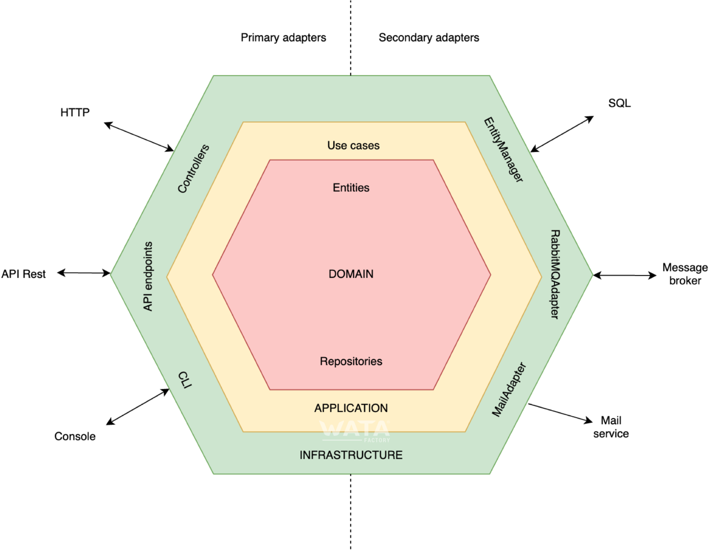
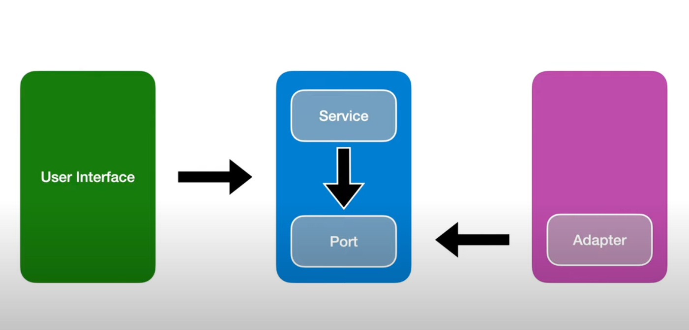

# Inditex Technical test

## How to Run

Follow these steps to start the Spring Boot application:

* **Open Terminal:** Open a terminal on your machine
* **Navigate to the Project Directory:** Use the `cd` command to navigate to the root directory of your Spring Boot
  project
* **Run the Application:** Use the following command to start the Spring Boot application:

```bash
   ./mvnw install
   ./mvnw spring-boot:run -pl main -o
```

---
`mvn install` compiles, packages, and copies your Java project and its dependencies to your local Maven repository so
that
it can be used as a dependency in other Maven projects. Additionally, it can run tests and perform code quality analysis
based on your project's configuration.

---
`mvn spring-boot:run -pl main -o` is used to run the Spring Boot application in the "main" module of your current
project in offline mode. This means that
Maven won't attempt to download dependencies from remote repositories and will rely solely on dependencies stored
locally in your Maven local repository.

---

`mvn verify`  will separately run all the application tests/ 

---
Now the application should be running, we are able to make curls to localhost:

```curl
  curl http://localhost:8080/prices/products/35455/brands/1\?date\=2020-06-14T16:00
```

## Project Architecture

This project is based in Hexagonal architecture aka Ports and Adapters Architecture.



## Layers of Hexagonal Architecture

1. **Domain Layer:**

- Responsibility: Contains the core business logic of the application.
- Key Elements: Entities, value objects, domain services.
- Isolation: Should be independent of external technologies and frameworks.

2. **Application Layer:**

- Responsibility: Acts as an intermediary between the domain layer and external layers.
- Key Elements: Use cases, application services.
- Isolation: Should not contain business logic but coordinates interactions between the domain layer and external
  layers.

3. **Adapters Layer:**

- Responsibility: Provides the communication interface between the application and the outside world.
- Key Elements: Primary adapters (controllers), secondary adapters (gateways, repositories).
- Isolation: Adapts requests and responses from external layers to be understandable by the application layer.

## Benefits of Hexagonal Architecture

- **Decoupling:** The layers are highly decoupled, making it easy to substitute components without affecting the rest of
  the application.
- **Testability:** Business logic in the domain layer is easy to test since it does not depend on external technologies.
- **Flexibility:** Enables adapting the application to new requirements and technologies without significant
  restructuring efforts.



### Jacoco files

The jacoco report can be found in the module report in the path
`/target/site/jacoco-aggregate/index.html`

### What can be improved

This project it is far to be perfect, the intention was to complete de objectives, but still are things to be refined.

#### Logs

The project does not have logs or metrics, those should be included.
Those can be included using Sl4J, and also using the logback library which log the rest calls


   
